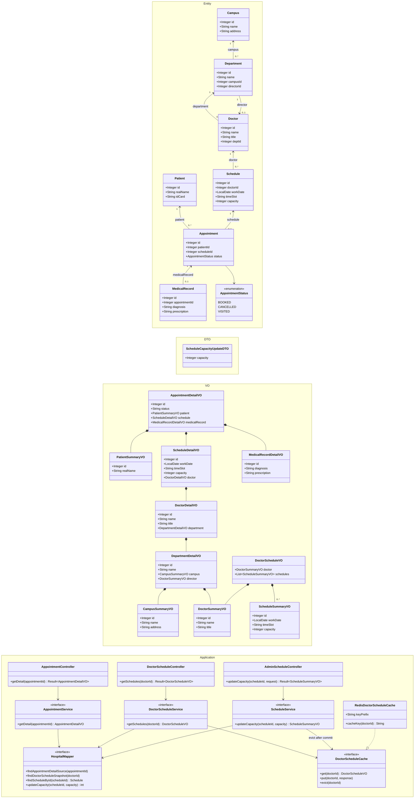

# 附录：总体 UML 类图

## 阅读说明

此图分为三层：

- `Entity`：与既有数据库表一一对应的内部对象，可以表达双向业务关系，但禁止直接作为 HTTP 或缓存值返回。
- `DTO`：仅接收 HTTP 请求参数；本期为 `ScheduleCapacityUpdateDTO`。
- `VO`：接口响应的单向数据树；它们不反向引用实体或其他 VO，保证 JSON 有限且无循环。
- `Service / Mapper`：Service 负责按场景查询、组装 VO、管理 Redis 缓存与事务；Mapper 仅负责数据访问。

类中的字段为本期核心字段，省略 getter/setter、日志器、配置类等实现细节。`MedicalRecord` 与 `Appointment` 的关系是 `0..1`：一张挂号单可尚未产生病历。分层、命名、统一 `Result<T>` 响应与异常处理遵循 [backend-conventions.md](backend-conventions.md)。

## Mermaid UML 类图

## 开发约束（与图配套）

1. `Campus`、`Department`、`Doctor` 等 Entity 之间可通过外键 ID 或受控对象关系表达业务关联；Mapper 查询必须按场景取数，不能自动加载所有集合关系。
2. Controller 使用 DTO 接收请求、用 `@Valid` 执行参数校验，并返回 `Result<VO>`（或统一错误响应），绝不能直接使用或暴露 Entity；Controller 不直接调用 Mapper。
3. `AppointmentDetailVO` 与 `DoctorScheduleVO` 不应共享可变实体对象；缓存存储的是后者序列化后的 JSON 数据部分。
4. `ScheduleService` 的实现必须在 Service 层事务提交成功后调用 `DoctorScheduleCache.evict(doctorId)`；若失效失败则命令失败并告警。
5. `HospitalMapper` 为数据访问职责接口而非强制的单一 Java 文件。若项目采用 MyBatis，可按查询场景拆分多个 `XxxMapper`，但不得为抽象而抽象；业务规则不得放入 Mapper。
6. Service 接口与实现分别命名为 `XxxService`、`XxxServiceImpl`；`AppointmentStatus` 等固定集合置于 `enums/`，全局异常处理器负责把 Service 业务异常转换为统一响应。

## 对照接口

| 接口 | 入口 | 主要服务 | 返回 `Result<VO>` | 缓存行为 |
| --- | --- | --- | --- |
| `GET /api/appointments/{id}` | `AppointmentController` | `AppointmentService` | `Result<AppointmentDetailVO>` | 本期不缓存 |
| `GET /api/doctors/{id}/schedules` | `DoctorScheduleController` | `DoctorScheduleService` | `Result<DoctorScheduleVO>` | Cache-Aside，Redis JSON |
| `PATCH /api/admin/schedules/{id}/capacity` | `AdminScheduleController` | `ScheduleService` | `Result<ScheduleSummaryVO>` | 提交后精准删除医生键 |
